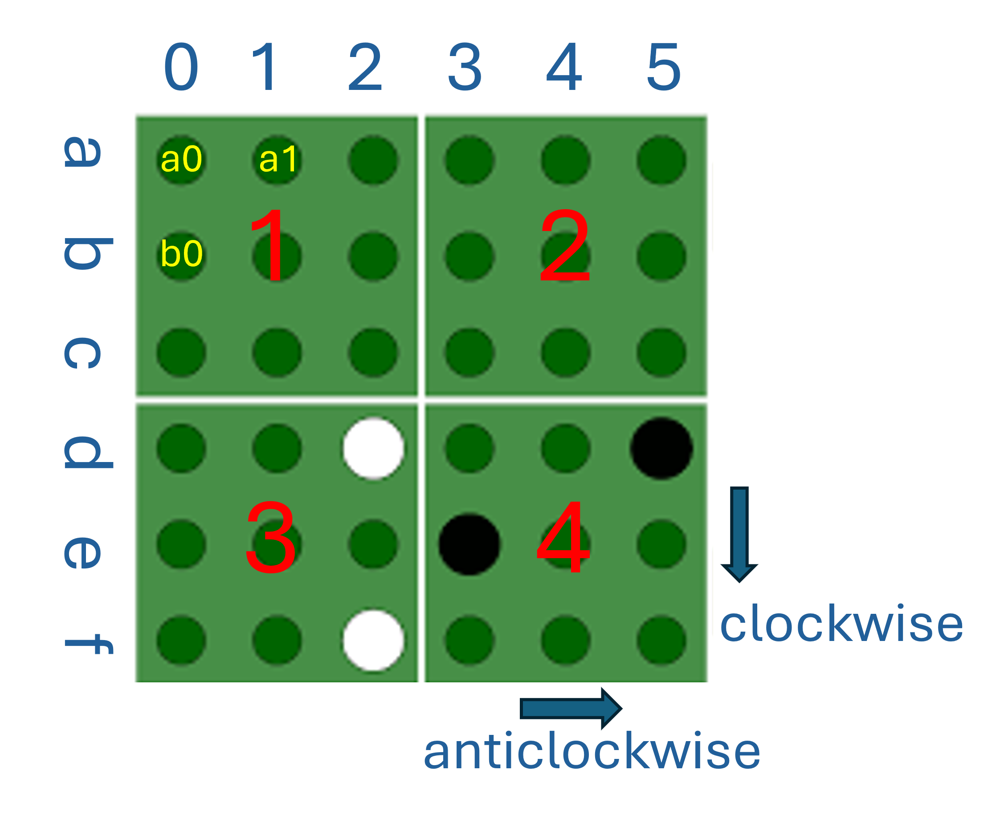

# Pentago Gamo
Pentago is a two-player abstract strategy game played on a 6×6 board, which is divided into four 3×3 sub-boards (or quadrants). Players take turns placing a marble of their color (either black or white) onto an unoccupied space on the board and then rotating one of the sub-boards by 90 degrees, either clockwise or anti-clockwise. The rotation step is mandatory, and the player can choose to rotate any of the four sub-boards, not necessarily the one where they placed the marble.

To learn how to play the game, check out this video: How to Play Pentago.[(https://boardgamegeek.com/video/482262/pentago/how-to-play-pentago)](https://boardgamegeek.com/video/482262/pentago/how-to-play-pentago) and you could play it by yourself in this website: [(https://pentago.vercel.app/)](https://pentago.vercel.app/)

A player wins by getting five of their marbles in a vertical, horizontal, or diagonal row, either before or after the sub-board rotation. If a player achieves five-in-a-row before the rotation step, the game ends immediately, and the player doesn't need to rotate a sub-board. If both players achieve five-in-a-row after the rotation, the game is a draw. If only the opponent gets a five-in-a-row after the rotation, the opponent wins. If all 36 spaces on the entire board are occupied without forming a row of five after the rotation, the game ends in a draw.

For example, after the white player places a marble on the board, several scenarios could occur:

If the white player achieves five-in-a-row, they win immediately.

If the white player does not achieve five-in-a-row, after the rotation:

* If neither white nor black has a five-in-a-row, the game continues.
* If black achieves five-in-a-row, black wins.
* If white achieves five-in-a-row, white wins.
* If both players achieve five-in-a-row, the game is a draw.
 
If neither white nor black has a five-in-a-row after the rotation and the board is full with 36 pieces, the game ends in a draw.

Here, we assume that **black will play first**. The figure "game_board" illustrates how the board will be labeled using our notation. The four sub-boards are labeled with the integers 1, 2, 3, and 4, as shown in the figure. The six rows are labeled from 'a' to 'f' from top to bottom, and the six columns are labeled from '0' to '5' from left to right. Each space on the board can then be referred to as 'a0', 'a1', and so on.


Here's a very simple example of how the class could be used:

```
game = Pentago()
print(game.make_move('black', 'a2', 1, 'C'))
print(game.make_move('white', 'a2', 1, 'C'))
print(game.is_board_full())
game.print_board()
print(game.get_game_state())

```
And the output could look like this:

True

True

False

□   □   □   □   □   □

□   □   □   □   □   □

●   □   ○   □   □   □

□   □   □   □   □   □

□   □   □   □   □   □

□   □   □   □   □   □

UNFINISHED

